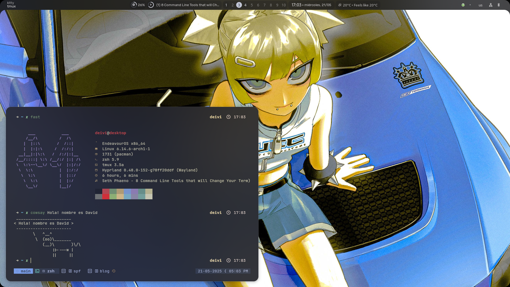

# Introducción

Este es un blog personal en el que procuraré enfocarme principalmente en el ámbito tecnológico, aunque no de forma exclusiva. También será un espacio donde recopile notas, reflexiones y contenidos relacionados con la ciencia y otros temas de interés.

Te recomiendo pasar por la sección [[Sobre-mi|sobre mí]] para conocer un poco más sobre quién soy. Me gustaría que este sitio no solo me sirviera como herramienta personal, sino que también pueda resultar útil o interesante para otras personas, especialmente en lo relacionado con las notas técnicas que iré compartiendo.

Mi objetivo es documentar aquí mi trayecto en el mundo tech hasta conseguir mi primer trabajo en el sector. Como aún soy estudiante, procuraré mantener este espacio lo más actualizado posible.

---

## Estructura del blog

1. **[CARPETA]** Notas  
2. **[ENTRADA]** Pendientes  
3. **[ENTRADA]** Ideas  
4. **[CARPETA]** Proyectos

> He pensado esta estructura con la intención de mantener todo simple y organizado.  
> Las **notas** funcionarán como un diario donde registraré avances diarios o reflexiones sobre proyectos y aprendizajes.  
> Las **ideas** serán conceptos sueltos, ocurrencias o posibles temas a desarrollar que aún no son proyectos concretos.  
> Y los **proyectos** serán aquellos trabajos que considere relevantes o dignos de documentar y compartir.

